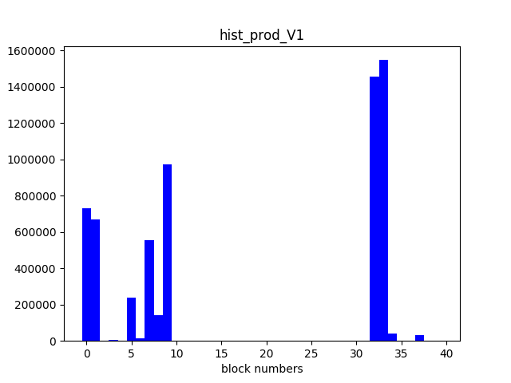
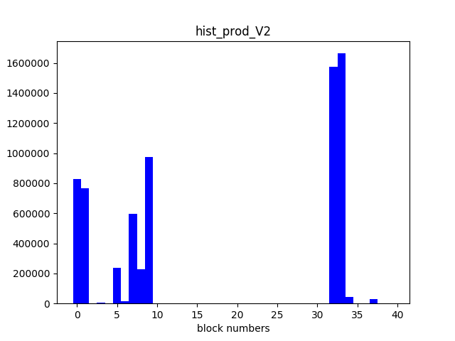
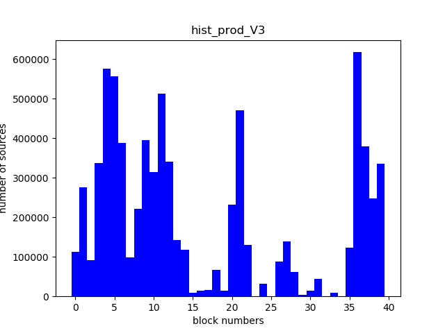
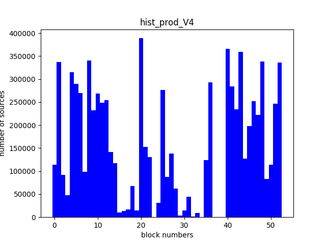
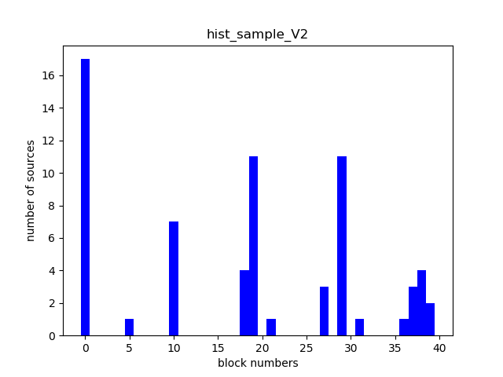

# SPARK - Partionnement d'observations dans le ciel 

>Date : Nov. 2017 

>Auteurs : Alice MONTEL et Mathilde Boltenhagen

>Langage : Python 3.6.3

>Outils : pyspark, pytest  

# Etudiants

compte_etudiant1: p1610748   
nom_etudiant1: Boltenhagen    
prenom_etudiant1: Mathilde    
compte_etudiant2: p1309529    
nom_etudiant2: Montel       
prenom_etudiant2: Alice    

# Introduction  

Ce projet contient nos quatres **versions fonctionnelles** ainsi que leur test unitaire. Voici, ci-dessous, une correspondance entre le numéro de version et **l'extension ajoutée par rapport à la version précédente** :

| Version | Extension | 
| ------- | --------- | 
| V1.py   | Simple répartition| 
| V2.py   | Ajout de recoupement, 5% | 
| V3.py   | Modification des coordonnées célestes | 
| V4.py   | Meilleure répartition des blocs | 

Voici une vue globale de l'arborescence du projet : 
<pre>  
 ┬  
 ├ Results
     ┬  
     ├ result_prod_V1.csv
     ├ hist_prod_V1.pgn 
     └ ...
 ├ Source 
 ├ src  
     ┬   
     ├ main  
         ┬  
         ├ V1.py
         ├ V2.py
         ├ V3.py
         ├ V4.py
         ├ MapOfBlocks.py
         └ mymath.py
     └ test
         ┬  
         ├ test_V1.py
         ├ test_V2.py
         ├ test_V3.py
         ├ test_V4.py
         └ conftest.py
     
 ├ COMPTE_RENDU.MD
 ├ etudiants.yml
 
 
</pre>


# Démarche

Afin de réaliser le partitionnement des sources, nous avons choisi de créer une classe **MapOfBlocks** qui permet de stocker toutes les informations relatives à la grille de la voûte céleste que l'on veut imaginer.
La première étape sera donc d'initialiser cette classe.
Pour cela, on va d'abord diviser la taille de nos données sources par la taille de blocs souhaitée, ici 128Mo, afin de savoir combien de blocs devraient être créés s'ils faisaient tous 128Mo.
On décompose ensuite ce nombre de blocs en un produit de facteurs premiers. Ainsi, on connaît la configuration de notre grille représentant la voûte céleste, c'est-à-dire, le nombre de lignes et de colonnes.
On crée ensuite un RDD qui nous permet de récupérer les valeurs minimales et maximales pour chacune des variables ra et decl. On obtient donc les coordonnées de notre grille. Comme on sait combien de lignes et de colonnes on souhaite, il suffit de diviser l'intervalle de coordonnées par le nombre de case souhaité, soit :
>(max_ra - min_ra)/facteur1 = i et (max_decl - min_decl)/facteur2 = j,

où facteur1*facteur2 = nombre de blocs et i (respectivement j) est donc le pas pour chaque colonne (respectivement ligne).
Grâce à ces pas, on peut définir les coordonnées minimales et maximales pour chacune de nos partitions. 
On crée donc un dictionnaire python qui regroupe les blocs et leurs coordonnées, de la forme :
>(1 : (min_ra,max_ra),(min_decl, max_decl), 2: (min_ra, max_ra), (min_decl,max_decl) [....])

Ensuite, pour chaque source, on récupère les coordonnées ra et decl et on cherche le bloc dans lequel elle devrait se trouver. Cela permet de compter le nombre de source qui devrait se trouver dans chaque bloc, et donc de compter le nombre de ligne par partition. 
Ensuite, on répartit les sources et on les écrit dans des fichiers distincts correspondants aux blocs voulus. 
On crée donc un fichier par partition sur HDFS, dans un répertoire précisé en paramètre lors du lancement de l'application, comme suit : 

```sh
spark-submit ./src/main/Vi.py /chemin/vers/sources /chemin/vers/resultats
```

A la fin de l'exécution, le répertoire resultats contiendra une série de fichiers csv, nommé `part-00000`, `part-00001`, etc., contenant les lignes de sources de la partition adéquate. 
Un fichier des propriétés est aussi créé dans le ficher csv `resultats/properties/part-00000`. Il contient le nombre de blocs, les coordonnées des blocs ainsi que le nombre de sources par blocs, une source étant une ligne.

### Amélioration sur les bordures (V2)
Suite au premier partionnement, on cherche à dupliquer les informations en bordure case pour simplifier l'accès à des sources proches entre elles, et proches de la bordure de leurs cases respectives.
Pour cela, lorsqu'on attribue un bloc à chaque source à partir de son couple de coordonées (`ra` et `decl`), on ne le compare plus aux coordonées de la case, mais aux coordonnées de la case  **+/- 5%**  des valeurs. 
Ainsi, une source proche de la bordure d'une case sera ajoutée non seulement dans le bloc de cette case, mais aussi dans le bloc de la case voisine. 

### Amélioration sur la géométrie des coordonnées célestes (V3)
Pour les premières approximation, on considère que la voûte céleste est un rectangle et que les coordonnées récupérées sont des coordonnées cartésiennes. Cela crée des zones de tailles très inégales, et donc un partitionnement mal réparti. 
Nous avons donc transformé les coordonnées célestes en coordonnées écliptiques afin d'avoir une approximation plus exacte de leur placement. 
Pour cela, nous avons créé deux fonctions mathématiques dans notre fichier **mymath.py** permettant de calculer `lambda` et `beta`, la latitude et longitude écliptiques de la source.   
```sh
def getL(ra, decl):
    e = 23,439281
    l = math.atan( ((math.sin(e)/math.cos(ra)) * math.tan(decl)) +( (math.cos(e)/math.cos(ra))*math.tan(ra)))
    return l

def getB(ra, decl):
    e = 23,439281
    b= math.asin( ( math.cos(e) * math.sin(decl)) - (math.sin(e)*math.sin(ra)*math.cos(decl))  )
    return b
```
Ce changement de coordonnées doit permettre d'obtenir une meilleure répartition des sources dans les blocs, mais pour l'instant, sans limite maximale sur la taille du bloc. 

### Redivision de cases trop chargées (V4)
Dans cette dernière amélioration, on cherche à répartir au mieux les sources, mais aussi à créer des blocs de volume limité. Ainsi, si un bloc contient trop de sources, on le divise.
Pour faire cela, on calcule une première fois le nombre de blocs à créer. On récupère le nombre de blocs vides dûs à la répartition inégales des sources. On les supprime de la liste de blocs, et on les réutilise en modifiant les coordonées pour diviser les blocs existants trop volumineux.
S'il n'y a plus de bloc vide, on en crée des nouveaux (par dix).

Nous avons calculé manuellement le nombre de lignes approximatif d'un fichier de maximum 128Mo à partir du fichier source-sample. Cela revient à écrire moins de **175000** sources par bloc.
Afin de s'assurer qu'aucun bloc ne dépasse ce nombre, nous pourrions faire autant de divisions que nécessaire de la manière suivante  :

```sh
1. compter le nombre de sources par blocs avec un partionnement simple
2. tant qu'il reste au moins un bloc qui contient trop de sources
     |   faire une division de ces blocs
     |   re-compter le nombre de sources par blocs
    fin du tant que 
3. patitionner avec le dictionnaire des blocs 
```
Dans notre cas, nous nous sommes contentés d'une seule division pour des raisons de vitesses de calculs sur les serveurs hadoop. 

# Résultats 

### Première approximation (V1)
Une première version permet de répartir les sources dans des cases de **dimensions fixes**. Cela a pour effet de créer des partitions très lourdes (avec beaucoup de sources), et d'autres quasiment vides, puisque les sources sont très inégalement réparties sur la grille. 
On observe facilement l'inaglité de répartition sur les histogrammes suivants : 

  Le fichier de propriétés correspondant :  

On observe dans cette première division naïve que les sources sont réparties dans 40 blocs, donc 40 fichiers csv. En effet, le nombre de blocs est basé uniquement sur le volume des sources et non sur leur répartition.
Ainsi de nombreux fichiers sont vides, tandis que d'autres contiennent un nombre de lignes trop conséquents. 

### Deuxième approche (V2)
Dans cette deuxième approche, on considère un certain **recoupement** (ici 5%) entre les blocs. Cela implique que les fichiers csv résultants du partitionnement contiennent plus de lignes. Cependant, on doit avoir le même nombre de partitions que dans la première approche. 
On constate que c'est bien ce qu'on obtient grâce aux histogrammes ci-dessous : 

  Le fichier de propriétés correspondant :   

On observe ici que le nombre de blocs remplis est le même. Cependant les fichiers contiennent plus de lignes, c'est-à-dire plus de sources, puisque les sources proches des bordures sont dupliquées dans plusieurs blocs, donc plusieurs fichiers. 

### Troisième approche (V3)
Jusqu'à présent, on utilisait les coordonnées célestes (`ra` et `decl`) pour répartir les sources. 
Afin d'avoir une meilleure approximation, on utilise `ra` et `decl` pour calculer les coordonnées écliptiques `lambda` et `beta` qui correspondent à la latitude et la longitude. 

  Le fichier de propriétés correspondant :   

### Dernière approche (V4)
Dans cette dernière version de partitionnement, on considère non seulement les coordonnées écliptiques et la duplication des sources, mais aussi la redivision de blocs trop volumineux. 
On observe donc en sortie qu'il y a plus de blocs remplis, et que le nombre de sources dans les blocs a majestueusement diminué. 

  Le fichier de propriétés correspondant :   

# Test en local avec pystest 

Les tests unitaires ont été faits en local sur nos PC personnels avec l'installation de spark, hadoop et `pytest` avec la configuration expliquée [ici](https://github.com/BoltMaud/Pyspark_pytest/blob/master/README.md). Le fichier `conftest.py`
est nécessaire à la configuration des tests. 

L'utilisation de spark-submit empêche la correspondance des packages et modules en python, ainsi les imports se font directement par le nom du fichier. Cependant pour le lancement des tests
unitaires, il faut reprendre les packages. Les lignes **from src.main import MapOfBloc** et  **from src.main import mymath** doivent alors être décommentés. 
Il faut aussi décommenter la ligne du lancement du main, dernière ligne du fichier. Il maintenant possible de lancer un test avec la commande suivante : 

```sh
py.test ./src/test/test_Vi.py
```

Les tests utilisent le fichier **source-sample.csv** et vérifient le nombre de blocs, les min et max des variables **ra** et **decl** ainsi que le nombre de source par bloc, (ci-dessous un exemple du test_V1)

```sh 
assert mapOfBlocks.nbBlocks == 40
assert mapOfBlocks.max_ra == 358.0904167299142
assert mapOfBlocks.min_ra == 357.9542095807038
assert mapOfBlocks.max_decl == 3.1752713951351934
assert mapOfBlocks.min_decl == 2.5646291352701804
```
Il possible d'obtenir les fichiers des blocs ainsi que les fichiers de propriétés en décommentant les dernières lignes des fichiers tests. Ces lignes ont été volontairement commentées afin de ne pas
occuper de la place non voulue par l'utilisateur des tests. 

Les résultats obtenus pour le fichier sample avec une grille de 40 blocs à l'initialisation sont : 


    
  
 
On a bien les résultats attendus avec une augementation du nombre de sources par bloc entre la version 1 et la version 2 due aux marges. Puis de la version 2 à la version 3, on constate que la répartition est 
mieux gérée grace au changement de repère. Enfin de la version 3 à la version 4, on diminue le nombre de sources par bloc grâce à la division des gros blocs. 


Ainsi que leurs fichiers de propriétés :

*  
*  
*  
*  

